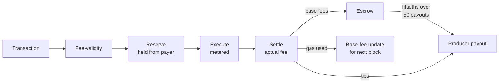

<aside>
⚠️

*This document is in active development, meaning that its content can and probably will change quickly, and has not yet been approved as final. DO NOT take it as a finalized document, and DO NOT use it to start building things until the [WIP] above is removed.*

</aside>

# Introduction

LEZ is an execution zone on the Logos (Bedrock) chain supporting public transactions, executed by the sequencer, and private transactions, verified from a RISC Zero proof. This document specifies the LEZ fee subsystem: fee-related transaction validity, what each transaction pays, who pays and who is paid, how prices adjust, and the exact integer arithmetic and state transition for all of it.

**Summary.** Execution and storage are priced by two independent EIP-1559-style markets in pure integer arithmetic. Every private transaction is charged identical, protocol-fixed resource quantities, so within a block all private transactions pay the same fee and fees reveal nothing about private computation. Fees are held from payer accounts as an upfront reservation, settled to the actual amount after execution, and accumulated in an escrow that pays block producers in fiftieths: one share in the collecting block and one in each of the 49 blocks after it. Tips go directly to the producer. Nothing is burned.

## Objectives

1. Price congestion on the two resources a block consumes: execution (zkVM cycles) and storage (bytes posted to Bedrock).
2. Preserve privacy: fee amounts must not distinguish one private transaction from another.
3. Be deterministic and implementable: integer-only arithmetic, concrete values for every parameter (one provisional value is flagged inline), identical results across implementations and build profiles.
4. Operate independently of L1 price signals: the mechanism reads nothing from Bedrock.

## Scope and non-goals

This specification defines the fee subsystem and its ledger effects. It consumes two canonical inputs per transaction, a metered cycle count and a serialized byte length, whose producing algorithms belong to the LEZ execution and wire-format specifications (see *Interfaces*). Out of scope: the Bedrock fee market (L1 posting is funded out-of-band by the sequencer's node wallet); the mechanism by which private users fund their fee account without linking identities, defined in a companion specification, linked here once it exists; any such mechanism acts as the payer through the fee authorization defined under *Transactions*, and this document requires only that the authorization is valid and the reservation succeeds; sequencer reward distribution beyond the per-block payout defined here; data availability; proof aggregation.

# Overview

A transaction's fee is gas times price, summed over two resources. Each resource has its own base fee. Usage above target always raises the base fee by at least one unit; usage below target never raises it and lowers it subject to integer rounding and the minimum. Either move is capped at 12.5% per block. Public transactions may attach a tip.



**Two markets.** Execution gas measures sequencer work: metered zkVM cycles for public transactions, a fixed verification cost for private ones. Storage gas measures bytes the block contributes to the Bedrock post: serialized size for public transactions, the fixed serialized size of any private transaction. The markets are independent: a block can be execution-full and storage-light or the reverse, and each base fee responds only to its own resource.

**Reserve, execute, settle.** The exact execution fee is known only after execution, so payment works in two steps. Before a transaction executes, its worst-case fee (its `gas_limit` priced at the current base fees, plus storage and tip) is held from the payer. After execution, the actual fee is computed from metered cycles and the unused part of the reservation is released back to the payer. Payment is guaranteed before any work is done, and execution sees a deterministic balance.

**Privacy.** Every private transaction is charged `PRIVATE_VERIFY_GAS` execution gas and `PRIVATE_GAS_STOR` storage gas, constants of the protocol version, and carries no public fee fields. Its fee depends only on the current base fees, never on its contents; within a block, all private transactions pay the same amount.

**Distribution.** Settled base fees accumulate in an escrow. Each block's base revenue is paid out in fiftieths: one share in the collecting block and one in each of the 49 blocks after it, with the integer-division remainder carried forward, so every unit collected is eventually paid. Smoothing also made all tested always-on self-dealing strategies unprofitable: inflating the base fee with junk pays that fee now and recovers it slowly, mostly to other producers (adaptive strategies remain an open risk; see *Manipulation resistance*). No tokens are burned: LEZ has no minting mechanism to compensate a burn.

**Worked example.** *At genesis both base fees are 8 atomic units. A public transaction of 50,000 cycles carrying 200 bytes pays 50,000·8 + 200·8 = 401,600 atomic units (about 0.0004 LGO). Any private transaction pays 409,764·8 + 224,063·8 = 5,070,616 atomic units (about 0.005 LGO), identical for all of them in that block.*

# Protocol

## Conventions

All quantities are unsigned integers. Monetary amounts are denominated in the atomic unit, with 1 LGO = 10⁹ atomic units. The total supply is 10¹⁹ atomic units.

Base fees, gas amounts, and per-resource fee products MUST fit in 64 bits; the parameter caps below guarantee this for every valid block. Fee totals, balances, revenue totals, and every intermediate product MUST be computed in at least 128-bit width. Because the total supply is below 2⁶⁴, no account balance or credit can overflow 128-bit arithmetic. Implementations MUST NOT rely on language-level overflow behavior, and MUST produce identical results in checked and unchecked build profiles. The only arithmetic division in the protocol is floor division of non-negative integers; no other rounding exists and floating point MUST NOT appear anywhere.

## Interfaces

The protocol consumes two deterministic per-transaction inputs. Their producing algorithms are consensus-critical but external to this document:

- **Metered cycles** (public transactions): the zkVM executor's deterministic user-cycle count for the transaction's execution trace, with metering halted at the transaction's `gas_limit`. Defined by the LEZ execution specification. This count is the gas unit; there is no separate opcode weighting.
- **Serialized length** (public transactions): the byte length of the transaction's canonical serialization as it appears in the block payload posted to Bedrock. Defined by the LEZ wire-format specification. It is at least 1 for any real transaction.

For private transactions, the wire-format specification MUST produce a constant serialized size equal to `PRIVATE_GAS_STOR` (envelope, proof, and padded payload included), for every private transaction, and together with the proof validity rules MUST enforce the unpadded payload bound `PRIVATE_PAD_BYTES`. Block framing and other block-level overhead bytes are not charged to transactions and are borne by the producer. The execution, wire-format, and ledger specifications named here are part of the protocol version; their exact revisions MUST be pinned when protocol version 1 is frozen (tracked with the wire-size TODO under *Parameters*).

## Transactions

Fee-relevant transaction fields. *Signed* fields are chosen and authorized by the sender; *derived* fields are produced by serialization. Fields marked absent do not appear in the private wire format; implementations represent them internally as zero.

| Field | Type | Source | Public | Private |
| --- | --- | --- | --- | --- |
| `payer` | AccountId (ledger spec) | signed | fee account debited | fee account debited |
| `gas_limit` | u64 | signed | execution bound; metering halts here | absent |
| `data_bytes` | u64 | derived | canonical serialized length | fixed at `PRIVATE_GAS_STOR` by the wire format |
| `tip` | u64 | signed | priority payment, MAY be 0 | absent |
| `max_fee` | u128 | signed | cap on `fee_reserve` | absent |

`cycles` is not a transaction field. It is part of the execution outcome: the metered cycle count the executor produces while running the transaction, with metering halted at `gas_limit`. An outcome with `cycles` above `gas_limit` is an executor defect and a consensus fault, not a transaction validity failure. A private transaction's unpadded payload length is likewise not a fee-relevant field: the proof and wire-format validity rules MUST enforce that the payload fits within `PRIVATE_PAD_BYTES`, and the fee subsystem assigns every externally valid private transaction the fixed storage gas `PRIVATE_GAS_STOR`.

The payer is any account whose fee authorization accompanies the transaction: an explicit designation plus a signature, or a program authorization, over the fee fields and the exact transaction they cover, defined by the transaction-format specification. The payer MAY be one of the transaction's signers and MAY be a third party outside the witness set, which permits sponsored transactions; the fee subsystem requires only that the authorization is valid and that the reservation succeeds. The payer MUST be designated explicitly, never inferred by convention from the witness set.

`max_fee` bounds the payer's exposure: a transaction whose fee terms were authorized at low base fees cannot be included later at prices whose reservation exceeds its cap.

Program deployment transactions are public transactions for fee purposes: the deployed program's bytes are part of `data_bytes` through the canonical serialization, and execution is metered like any public transaction. A single transaction therefore cannot deploy a program larger than `MAX_GAS_STOR` bytes. Signing a private transaction authorizes the fee computed at its inclusion block; there is no consensus-enforced private fee cap, and the only bound is the payer account's balance. Wallets can bound exposure operationally because the private fee is computable from public state before submission.

## State

| Name | Type | Meaning |
| --- | --- | --- |
| `base_fee_exec` | u64 | Execution base fee for the current block |
| `base_fee_stor` | u64 | Storage base fee for the current block |
| `escrow` | u128 | Settled base revenue not yet paid out |
| `window` | [u128; 50] | Base revenue of the last 50 blocks, zero-initialized |
| `payout_carry` | integer in [0, 49] | Payout division remainder |
| `height` | u64 | Block height; an increment at 2⁶⁴ - 1 is a consensus fault |

## Fee-validity

Fee-validity splits into **static** rules, checked before execution, and **dynamic** rules, enforced during the transition as metered cycles become known. The split is needed because `cycles` only exists after execution.

A transaction is statically fee-valid under this specification iff:

- **Private:** `tip`, `max_fee`, and `gas_limit` are all 0 (absent). Its canonical wire size equals `PRIVATE_GAS_STOR` and its unpadded payload fits `PRIVATE_PAD_BYTES`; both are enforced by the wire-format and proof validity rules, not by the fee subsystem.
- **Public:** 1 ≤ `data_bytes` ≤ `MAX_GAS_STOR`; `gas_limit` ≤ `MAX_GAS_EXEC`; and `fee_reserve` ≤ `max_fee` at the block's opening base fees.

A transaction MUST also satisfy every validity condition imposed by the execution, proof, wire-format, ledger, and consensus specifications. A private transaction with an invalid proof is an invalid transaction, not a reverted one: it cannot be included, and a block containing it is invalid.

A block is fee-valid iff every transaction is statically fee-valid, the storage total is within its cap (serialized lengths are known before execution), every fee reservation succeeds, and the cumulative metered execution gas stays within its cap as transactions execute:

```python
sum(gas_stor(tx) for tx in txs) <= MAX_GAS_STOR    # static, before execution
cumulative metered cycles       <= MAX_GAS_EXEC    # dynamic, per Block transition
```

One invalid transaction invalidates the whole block, and a block whose cumulative executed cycles exceed the cap at any transaction is rejected in full. The caps apply to consumed gas; block builders SHOULD budget by `gas_limit` when selecting transactions. Totals MUST be accumulated in widened arithmetic (the per-transaction bounds make each term fit u64, but the sums are checked, never wrapped). The resources are not fungible: a surplus in one MUST NOT offset a deficit in the other.

System transactions enumerated by the wire-format specification, such as the clock transaction, are outside the fee subsystem: no payer, no fee, and no contribution to either gas total. Like block framing, they are overhead borne by the producer. The exemption applies only to the enumerated kinds; every other included transaction is reserved and settled like any other.

Two consequences follow: since every public transaction has `data_bytes` ≥ 1 and every private transaction has fixed storage gas, a block contains at most `MAX_GAS_STOR` transactions and there are no zero-cost transactions; and at most ⌊`MAX_GAS_STOR`/`PRIVATE_GAS_STOR`⌋ = **4 private transactions fit in a block** under the current proof size.

## Fee assessment

Two amounts are defined per transaction, both at the block's opening base fees:

```python
fee_reserve(tx) = gas_limit * base_fee_exec + data_bytes * base_fee_stor + tip    # public
fee_reserve(tx) = PRIVATE_VERIFY_GAS * base_fee_exec + PRIVATE_GAS_STOR * base_fee_stor  # private

fee_base(tx) = gas_exec(tx) * base_fee_exec + gas_stor(tx) * base_fee_stor
fee_total(tx) = fee_base(tx) + tx.tip
```

with gas given by:

|  | `gas_exec` | `gas_stor` |
| --- | --- | --- |
| Public | `cycles` from the execution outcome (≤ `gas_limit`, an executor guarantee) | `data_bytes` |
| Private | `PRIVATE_VERIFY_GAS` | `PRIVATE_GAS_STOR` |

`fee_reserve` is the amount held before execution; only the execution component is uncertain in advance, so the reserve prices `gas_limit` where the actual fee prices `cycles`. For private transactions both gas quantities are constants, so the reserve equals the actual fee. A transaction that fails, reverts, or halts at its limit is charged for the cycles consumed to that point and its full storage gas (its bytes are posted regardless); the difference between reserve and actual fee is a released reservation, not a refund of work done. Spam always pays for the resources it consumes. An included transaction consumes its replay protection, defined by the ledger specification, whether it succeeds or reverts; the same fee authorization is never charged twice. The producer MAY use tips to choose an ordering; the protocol does not constrain that choice, but the order encoded in the block is, like all block contents, consensus data.

## Base-fee update

Each resource updates independently after every block. With current base fee `b`, gas used `g`, target `T`, denominator `d`, and bounds `lo`, `hi`:

```python
def next_base_fee(b, g, T, d, lo, hi):
    if g > T:
        deviation = min(g - T, T)
        delta = max(1, (b * deviation) // (T * d))   # 128-bit product
        return min(hi, b + delta)
    if g < T:
        deviation = min(T - g, T)
        delta = (b * deviation) // (T * d)           # 128-bit product
        return max(lo, b - delta)
    return b
```

Properties, each of which an implementation MUST preserve:

- **Bounded:** the per-block move is at most `max(1, b // d)` in either direction, which is ±12.5% at `d` = 8 (the deviation clamp enforces this bound for any parameterization).
- **Live upward:** the `max(1, ·)` term guarantees a rise of at least one unit whenever usage exceeds target, from any price. Without it, integer rounding pins low prices forever under congestion.
- **Asymmetric at small prices, by design:** the down-step has no matching minimum, so small deviations below target can round `delta` to zero and leave the price unchanged. One unit above target always moves the price; one unit below target usually does not. The resulting mild upward bias at low prices is accepted in exchange for guaranteed liveness.
- **Saturating:** the result is clamped to `[lo, hi]`. The caps make boundary behavior defined and identical across implementations; they are not reachable under realistic demand.

## Revenue distribution

Per block, after all transactions have settled:

1. `revenue_base` (the block's total settled `fee_base`) is credited to `escrow` and pushed into `window`, evicting the oldest of its 50 slots.
2. The payout is the window average with the division remainder carried across blocks:

```python
numerator = sum(window) + payout_carry
payout = numerator // SMOOTHING_WINDOW
payout_carry = numerator % SMOOTHING_WINDOW
escrow -= payout       # payout <= escrow always holds; see below
```

Then the producer's account is credited with `payout + revenue_tip`. This credit is the last ledger effect of the block, so tips earned in a block cannot fund a transaction in that same block.

This is exact amortization: each block's base revenue contributes to exactly 50 consecutive payouts, starting with the collecting block, so a revenue pulse is fully distributed after its 50th payout and nothing is stranded. Escrow records base revenue not yet paid; the window and carry determine the payout schedule, and window entries are historical revenue values, not individually unpaid balances. Because the window starts zero-filled and the carry makes the cumulative payout exactly ⌊Σ window-sums / 50⌋, cumulative payouts never exceed cumulative revenue and `payout ≤ escrow` holds at every block; an implementation SHOULD still check it and treat a violation as a consensus fault. Burning MUST NOT occur anywhere in the fee path.

## Block transition

The authoritative algorithm. Inputs: the pre-block state, the pre-block ledger balances, the block's transactions in block order, and the producer's account.

Block processing MUST be transactional. All validation, reservations, executions, settlements, escrow changes, window and carry changes, producer credits, height changes, and base-fee updates apply to a working copy of the state. If any validity condition fails, the block is rejected and the pre-block state and balances MUST remain unchanged, byte for byte. The working state is committed only after every condition has succeeded. A transaction-level failure or revert discards that transaction's execution effects but retains its settled fee; a block-level rejection discards everything. A consensus fault (an executor reporting cycles above `gas_limit`, or a height increment at 2⁶⁴ - 1) is not a rejection: it halts the node instead of producing a state.

**Execution state.** `balances` stands for the complete working consensus state: account balances and all execution-visible application state. Each transaction executes against a transaction-local checkpoint created after its fee reservation. On success its execution effects are retained; on revert or transaction-level failure they are discarded while its fee hold remains and is settled against consumed cycles. Successful execution effects and released reservations are visible to later transactions in the block. The producer's payout and tips are credited only after all transactions have settled, so neither is visible to any transaction in that block.

```python
def block_transition(pre_state, pre_balances, txs, producer):
    state, balances = copy(pre_state), copy(pre_balances)   # working copies

    # 1. Static fee-validity and the storage cap (see Fee-validity).
    validate_static_block(txs, state)           # reject -> pre-state unchanged
    if state.height == 2**64 - 1:
        consensus_fault("block height overflow")
    state.height += 1

    # 2. Reserve, execute, settle. In block order. The execution cap is
    # enforced as metered cycles become known.
    revenue_base = revenue_tip = 0
    gas_used_exec = gas_used_stor = 0
    for tx in txs:
        reserve = fee_reserve(tx, state)
        if balances[tx.payer] < reserve:
            reject("fee debit failed: payer cannot cover reserve")
        balances[tx.payer] -= reserve                       # hold the reserve
        if tx.kind is PUBLIC:
            outcome = execute(tx)     # metered, capped at gas_limit; tx-level
                                      # failure discards its execution effects,
                                      # not its fee
            if outcome.cycles > tx.gas_limit:
                consensus_fault("executor exceeded gas_limit")
            cycles = outcome.cycles
        else:
            cycles = PRIVATE_VERIFY_GAS         # proof validity is external
        gas_used_exec += cycles
        if gas_used_exec > MAX_GAS_EXEC:
            reject("block exceeds MAX_GAS_EXEC")
        gas_used_stor += gas_stor(tx)
        f_base = cycles * state.base_fee_exec + gas_stor(tx) * state.base_fee_stor
        balances[tx.payer] += reserve - (f_base + tx.tip)   # release unused part
        revenue_base += f_base
        revenue_tip += tx.tip

    # 3. Distribute (see Revenue distribution). Producer credit comes last.
    state.escrow += revenue_base
    state.window.push_evicting_oldest(revenue_base)
    numerator = sum(state.window) + state.payout_carry
    payout = numerator // SMOOTHING_WINDOW
    state.payout_carry = numerator % SMOOTHING_WINDOW
    state.escrow -= payout
    balances[producer] += payout + revenue_tip

    # 4. Base-fee updates for the next block (see Base-fee update).
    state.base_fee_exec = next_base_fee(state.base_fee_exec, gas_used_exec,
        TARGET_GAS_EXEC, D_EXEC, BASE_FEE_EXEC_MIN, BASE_FEE_EXEC_MAX)
    state.base_fee_stor = next_base_fee(state.base_fee_stor, gas_used_stor,
        TARGET_GAS_STOR, D_STOR, BASE_FEE_STOR_MIN, BASE_FEE_STOR_MAX)

    # 5. Commit.
    return state, balances
```

This applies to every included transaction, including any originated by the producer: the producer pays base fees on its own transactions in full, into the escrow. The manipulation analysis in *Details* depends on this rule.

## Parameters

All values are protocol constants. Changing any of them is a protocol-version change (see *Versioning*).

| Name | Value | Meaning |
| --- | --- | --- |
| `TARGET_GAS_EXEC` | 5,000,000 | Execution gas target per block |
| `MAX_GAS_EXEC` | 10,000,000 | Execution gas cap per block |
| `TARGET_GAS_STOR` | 500,000 | Storage bytes target per block |
| `MAX_GAS_STOR` | 1,000,000 | Storage bytes cap per block |
| `D_EXEC`, `D_STOR` | 8 | Adjustment denominators (max ±12.5%/block) |
| `BASE_FEE_EXEC_MIN` | 8 | Minimum execution base fee (atomic/gas) |
| `BASE_FEE_STOR_MIN` | 8 | Minimum storage base fee (atomic/byte) |
| `BASE_FEE_EXEC_MAX` | ⌊(2⁶⁴ - 1)/`MAX_GAS_EXEC`⌋ = 1,844,674,407,370 | Saturation cap |
| `BASE_FEE_STOR_MAX` | ⌊(2⁶⁴ - 1)/`MAX_GAS_STOR`⌋ = 18,446,744,073,709 | Saturation cap |
| `SMOOTHING_WINDOW` | 50 | Payout slots per unit of base revenue |
| `PRIVATE_VERIFY_GAS` | 409,764 | Execution gas of every private transaction |
| `PROOF_BYTES` | 223,551 | Proof bytes inside every private transaction |
| `PRIVATE_PAD_BYTES` | 512 | Payload size every private transaction is padded to |
| `PRIVATE_GAS_STOR` | 224,063 | Canonical serialized size of every private transaction |

<aside>
⚠️

TODO: `PRIVATE_PAD_BYTES` = 512 and the `PRIVATE_GAS_STOR` total are provisional. `PRIVATE_GAS_STOR` MUST equal the constant wire size of a private transaction (envelope, proof, and padded payload); the current value assumes zero envelope overhead. Re-pin both with the LEZ wire-format numbers.

</aside>

The minimums keep the integer controllers live (see *Details*); the caps make every per-resource fee product fit 64 bits. `PRIVATE_VERIFY_GAS` and `PROOF_BYTES` are measured values for STARK receipt verification (RISC Zero 3.0.5); the planned Groth16 upgrade changes both (see *Operating envelope*).

## Genesis

At genesis: `base_fee_exec` = `BASE_FEE_EXEC_MIN`, `base_fee_stor` = `BASE_FEE_STOR_MIN`, `escrow` = 0, `window` = 50 zero slots, `payout_carry` = 0, `height` = 0. Genesis validation MUST check `MAX_GAS_r` = 2·`TARGET_GAS_r` for both resources (the ±12.5% bound and the elasticity framing assume it). Prices start at the minimum and congestion alone moves them up.

## Invariants

A conformant implementation MUST preserve all of these after every committed block, and MUST treat a violation as a consensus fault:

1. **Conservation (cumulative).** Over any chain prefix: Σ `revenue_base` + Σ tips = `escrow` + Σ payouts + Σ tips paid. Per block: payer debits net of released reservations equal `revenue_base` + tips, producer credits equal payout + tips, and Δ`escrow` = `revenue_base` − payout.
2. **Bounded adjustment.** Each base fee stays in `[lo, hi]` and moves by at most `max(1, b // d)` per block.
3. **Private indistinguishability.** All private transactions in a block have identical `fee_total`.
4. **Escrow, window, carry.** `escrow ≥ 0`, payout ≤ escrow, `len(window)` = `SMOOTHING_WINDOW`, and `payout_carry < SMOOTHING_WINDOW`.
5. **Caps.** Both fee-validity caps hold, and `MAX_GAS_r · base_fee_r` fits u64 for both resources.
6. **Producer pays.** Producer-originated transactions are reserved and settled like any other.
7. **Atomicity.** A rejected block leaves state and balances unchanged.

# Details

## Why the integer delta form

A multiplicative update computed as a rounded product misbehaves at small prices: with floor rounding, prices below `d` can never rise but always fall, making zero absorbing; with round-half-to-even, prices at or below `d`/2 freeze in both directions. The delta form with a guaranteed +1 up-step rises from any price, and a minimum of `d` = 8 keeps proportional adjustment meaningful. At the top of the range, fee products (`gas × price`) overflow 64 bits roughly a hundred congested blocks *before* the price itself does, and every naive overflow semantics fails differently (wrapping forks consensus, checked halts the chain), so updates are computed widened and the price is clamped at `MAX_GAS`-aware caps under which every valid block's fee product fits u64. Full analysis and simulations: LEZ Fee Market Model, experiments E6, E10 to E12. At 10⁹ atomic units per LGO, the minimum of 8 prices a minimal transfer near 10⁻⁶ LGO, so the minimum has negligible cost.

## Privacy

The fee is the only protocol-visible quantity a private transaction chooses. Both of its gas amounts are protocol constants, its wire size is constant, and it carries no public fee fields, so its `fee_total` is a deterministic function of public state (the current base fees) alone. An observer learns nothing about the private computation, its complexity, or its payload size from fees or transaction size. The unpadded payload length is never exposed to the fee subsystem; the proof and wire-format validity rules enforce the bound. Bucketed padding (charging the smallest of a few fixed payload sizes, leaking ⌈log₂ buckets⌉ bits in exchange for cheaper small transactions) was considered and deferred; a single pad is the strongest choice and the simplest to implement.

## Manipulation resistance

Because base fees are retained rather than burned, a producer might try to stuff its own blocks with junk to inflate the base fee it later collects. Two mechanism features defeat the always-on version of this: the producer's junk pays the very base fee it inflates (invariant 6), and the smoothing window pays that revenue out over the next `SMOOTHING_WINDOW` blocks, mostly to other producers in the rotation, so only a small fraction of what the junk cost ever returns. Simulation of all four always-on strategies (execution/storage junk × rotation/cartel) found every one unprofitable (model document, E9). Open caveat: an adaptive stuff-then-harvest strategy is untested and plausibly profitable under fully inelastic demand; it is the named follow-up experiment, and the burn question reopens only if it succeeds.

On payout fairness: with equal production slots and stationary revenue, long-run payouts equalize across the rotation, since every producer draws the same window average in expectation. Exact per-rotation equality is not guaranteed; it depends on the revenue path and on where each producer's slots fall relative to the window.

## Operating envelope

Under the current STARK proof (223,551 B), storage bounds private throughput: 4 private transactions per block, and simulation under inelastic demand found no interior price equilibrium once private transactions exceed roughly 10 to 11% of submitted transaction count. Above that share the storage base fee keeps rising until demand yields or the saturation cap is reached. This is an operating constraint, not a mechanism fault. The planned Groth16 upgrade shrinks proofs to about 500 B, which removes the constraint; it re-pins `PRIVATE_VERIFY_GAS`, `PROOF_BYTES`, and `PRIVATE_GAS_STOR` .

# Annex

## A. Reference implementation (Python)

Informative executable model; the Protocol section governs on any disagreement. Integer-only, raises on invalid input, names match the specification one-to-one. `block_transition` is pure: it never mutates its inputs, so rejection cannot corrupt state. Execution is mocked through `mock_cycles`, test scaffolding that scripts the metering result; a real node obtains cycles from the execution outcome.

```python
"""LEZ fee market: executable model (informative; the Protocol prose is normative).

Integer-only. Every division is floor division on non-negative integers.
Names match the specification one-to-one. Raises on invalid input rather than
relying on `assert` (which `python -O` disables).

`block_transition` is pure: it never mutates its inputs. On rejection it
raises and the caller's pre-state is untouched, as the Protocol requires.

Execution is mocked: `mock_cycles` scripts the metering result the executor
would produce. It is test scaffolding, not wire data; a real node obtains
cycles from the execution outcome.
"""

from dataclasses import dataclass, field
from collections import deque
from copy import deepcopy
from enum import Enum

PROTOCOL_VERSION = 1

# --- Parameters (protocol constants) -----------------------------------------

TARGET_GAS_EXEC = 5_000_000        # execution gas target per block
MAX_GAS_EXEC = 10_000_000          # execution gas cap per block (= 2 * target)
TARGET_GAS_STOR = 500_000          # storage bytes target per block
MAX_GAS_STOR = 1_000_000           # storage bytes cap per block (= 2 * target)
D_EXEC = 8                         # execution adjustment denominator
D_STOR = 8                         # storage adjustment denominator
BASE_FEE_EXEC_MIN = 8              # atomic units per gas
BASE_FEE_STOR_MIN = 8              # atomic units per byte
BASE_FEE_EXEC_MAX = (2**64 - 1) // MAX_GAS_EXEC   # 1_844_674_407_370
BASE_FEE_STOR_MAX = (2**64 - 1) // MAX_GAS_STOR   # 18_446_744_073_709
SMOOTHING_WINDOW = 50              # payout slots per unit of base revenue
PRIVATE_VERIFY_GAS = 409_764       # execution gas of any private tx
PROOF_BYTES = 223_551              # proof bytes inside any private tx
PRIVATE_PAD_BYTES = 512            # TODO: confirm real payload size with LEZ
PRIVATE_GAS_STOR = PRIVATE_PAD_BYTES + PROOF_BYTES  # 224_063; see note below
# PRIVATE_GAS_STOR is the canonical serialized size of every private
# transaction (envelope, proof, and padded payload). The wire format MUST make
# this size constant. The provisional value assumes zero envelope overhead;
# it is re-pinned together with PRIVATE_PAD_BYTES once the wire numbers exist.
# The unpadded payload bound is enforced by the proof and wire-format validity
# rules, not by the fee subsystem.

TOTAL_SUPPLY = 10**19              # atomic units; bounds every real balance
U64_MAX = 2**64 - 1

if MAX_GAS_EXEC != 2 * TARGET_GAS_EXEC or MAX_GAS_STOR != 2 * TARGET_GAS_STOR:
    raise ValueError("genesis validation: MAX_GAS_r must equal 2 * TARGET_GAS_r")

class TxKind(Enum):
    PUBLIC = "public"
    PRIVATE = "private"

class InvalidBlock(Exception):
    """Block (or a transaction in it) violates a validity rule."""

class ConsensusFault(Exception):
    """A guarantee the mechanism relies on was violated; halt."""

@dataclass(frozen=True)
class Transaction:
    kind: TxKind
    payer: int             # AccountId; account debited for the fee
    gas_limit: int = 0     # u64; public: declared execution bound
    data_bytes: int = 0    # u64, derived; public: canonical serialized length
    tip: int = 0           # u64; atomic units; 0 for private
    max_fee: int = 0       # u128; public: signed cap on the fee reserve; 0 for private
    mock_cycles: int = 0   # TEST SCAFFOLD ONLY: scripted metering result.
                           # Not a wire field; a real node gets cycles from
                           # the execution outcome.

@dataclass(frozen=True)
class ExecutionOutcome:
    cycles: int            # metered cycles; the executor halts at gas_limit

def execute_public(tx: Transaction) -> ExecutionOutcome:
    """Mock executor. A real node runs the zkVM here, metering capped at
    gas_limit, applying execution effects to a transaction-local checkpoint."""
    return ExecutionOutcome(cycles=tx.mock_cycles)

@dataclass
class State:
    base_fee_exec: int = BASE_FEE_EXEC_MIN     # u64; genesis: the minimum
    base_fee_stor: int = BASE_FEE_STOR_MIN     # u64; genesis: the minimum
    escrow: int = 0                            # u128
    window: deque = field(default_factory=lambda: deque(
        [0] * SMOOTHING_WINDOW, maxlen=SMOOTHING_WINDOW))  # [u128; 50], zeros
    payout_carry: int = 0                      # in [0, SMOOTHING_WINDOW - 1]
    height: int = 0                            # u64; checked increment

```

```python

# --- Fee assessment -----------------------------------------------------------

def gas_stor(tx: Transaction) -> int:
    """Storage gas, known before execution."""
    if tx.kind is TxKind.PRIVATE:
        return PRIVATE_GAS_STOR
    return tx.data_bytes

def fee_reserve(tx: Transaction, state: State) -> int:
    """Amount held from the payer before execution. Only the execution part is
    uncertain in advance, so the reserve prices gas_limit instead of cycles."""
    if tx.kind is TxKind.PRIVATE:
        return (PRIVATE_VERIFY_GAS * state.base_fee_exec
                + PRIVATE_GAS_STOR * state.base_fee_stor)
    return (tx.gas_limit * state.base_fee_exec
            + tx.data_bytes * state.base_fee_stor + tx.tip)

def fee_actual_base(cycles: int, tx: Transaction, state: State) -> int:
    """Actual base fee, known once cycles are metered."""
    return cycles * state.base_fee_exec + gas_stor(tx) * state.base_fee_stor

```

```python

# --- Static fee-validity (everything known before execution) -------------------

def validate_static_tx(tx: Transaction, state: State) -> None:
    if not isinstance(tx.kind, TxKind):
        raise InvalidBlock("unknown transaction kind")
    for name in ("payer", "gas_limit", "data_bytes", "tip", "max_fee"):
        v = getattr(tx, name)
        if type(v) is not int or v < 0:     # bool is not accepted as int
            raise InvalidBlock(f"{name} must be a non-negative integer")
    if tx.tip > U64_MAX or tx.max_fee > 2**128 - 1:
        raise InvalidBlock("field exceeds its type width")
    if tx.kind is TxKind.PRIVATE:
        if tx.tip != 0 or tx.max_fee != 0 or tx.gas_limit != 0 or tx.data_bytes != 0:
            raise InvalidBlock("private tx carries a public-only field")
    else:
        if tx.data_bytes < 1:
            raise InvalidBlock("public tx serialization is empty")
        if tx.data_bytes > MAX_GAS_STOR:
            raise InvalidBlock("public tx exceeds MAX_GAS_STOR")
        if tx.gas_limit > MAX_GAS_EXEC:
            raise InvalidBlock("gas_limit exceeds MAX_GAS_EXEC")
        if fee_reserve(tx, state) > tx.max_fee:
            raise InvalidBlock("fee_reserve exceeds signed max_fee")

def validate_static_block(txs: list, state: State) -> None:
    """Static rules plus the storage cap; serialized lengths are known before
    execution. The execution cap is enforced dynamically in the transition."""
    total_stor = 0                          # unbounded int; compare, never wrap
    for tx in txs:
        validate_static_tx(tx, state)
        total_stor += gas_stor(tx)
        if total_stor > MAX_GAS_STOR:
            raise InvalidBlock("block exceeds MAX_GAS_STOR")
```

```python

# --- Base-fee update ----------------------------------------------------------

def next_base_fee(b: int, gas_used: int, target: int, d: int, lo: int, hi: int) -> int:
    if gas_used > target:
        deviation = min(gas_used - target, target)
        delta = max(1, (b * deviation) // (target * d))
        return min(hi, b + delta)
    if gas_used < target:
        deviation = min(target - gas_used, target)
        delta = (b * deviation) // (target * d)
        return max(lo, b - delta)
    return b

# --- Block transition ---------------------------------------------------------

@dataclass(frozen=True)
class BlockReceipt:
    height: int
    revenue_base: int
    revenue_tip: int
    payout: int

def block_transition(pre_state: State, pre_balances: dict, txs: list,
                     producer: int):
    """The normative transition. Returns (state, balances, receipt) on success;
    raises InvalidBlock on rejection, leaving pre_state and pre_balances
    untouched (they are never mutated)."""
    state = deepcopy(pre_state)                # working state
    balances = dict(pre_balances)              # working balances

    # 1. Static fee-validity and the storage cap (see Fee-validity).
    validate_static_block(txs, state)
    if state.height == U64_MAX:
        raise ConsensusFault("block height overflow")
    state.height += 1

    # 2. Reserve, execute, settle. In block order. The execution cap is
    # enforced as cycles become known.
    revenue_base = revenue_tip = 0
    gas_used_exec = gas_used_stor = 0
    for tx in txs:
        reserve = fee_reserve(tx, state)
        if balances.get(tx.payer, 0) < reserve:
            raise InvalidBlock("fee debit failed: payer cannot cover reserve")
        balances[tx.payer] -= reserve          # hold the reserve
        if tx.kind is TxKind.PUBLIC:
            # Execution happens against a transaction-local checkpoint; a
            # transaction-level failure discards its execution effects, not
            # its fee. The model applies no execution effects.
            outcome = execute_public(tx)
            if outcome.cycles > tx.gas_limit:
                raise ConsensusFault("executor exceeded gas_limit")
            cycles = outcome.cycles
        else:
            # Proof validity is external; an invalid proof is an invalid
            # transaction and never reaches this point.
            cycles = PRIVATE_VERIFY_GAS
        gas_used_exec += cycles
        if gas_used_exec > MAX_GAS_EXEC:
            raise InvalidBlock("block exceeds MAX_GAS_EXEC")
        gas_used_stor += gas_stor(tx)
        f_base = fee_actual_base(cycles, tx, state)
        balances[tx.payer] += reserve - (f_base + tx.tip)  # release unused part
        revenue_base += f_base
        revenue_tip += tx.tip

    # 3. Distribute: base fees through escrow; tips direct. The producer is
    # credited only here, after every transaction has settled, so neither
    # tips nor the payout of this block can fund a transaction in it.
    state.escrow += revenue_base
    state.window.append(revenue_base)          # evicts the oldest of the 50 slots
    numerator = sum(state.window) + state.payout_carry
    payout = numerator // SMOOTHING_WINDOW
    state.payout_carry = numerator % SMOOTHING_WINDOW
    if payout > state.escrow:
        raise ConsensusFault("payout exceeds escrow")   # unreachable by construction
    state.escrow -= payout
    balances[producer] = balances.get(producer, 0) + payout + revenue_tip

    # 4. Update base fees for the next block.
    state.base_fee_exec = next_base_fee(
        state.base_fee_exec, gas_used_exec, TARGET_GAS_EXEC, D_EXEC,
        BASE_FEE_EXEC_MIN, BASE_FEE_EXEC_MAX)
    state.base_fee_stor = next_base_fee(
        state.base_fee_stor, gas_used_stor, TARGET_GAS_STOR, D_STOR,
        BASE_FEE_STOR_MIN, BASE_FEE_STOR_MAX)

    # 5. Commit: the caller adopts the returned state and balances.
    return state, balances, BlockReceipt(state.height, revenue_base,
                                         revenue_tip, payout)
```

**Usage.** One block with one public and one private transaction, from genesis:

```python
from reference import *

state = State()
balances = {1: 10**12, 2: 0}          # payer, producer

txs = [
    Transaction(TxKind.PUBLIC, payer=1, gas_limit=60_000, data_bytes=200,
                tip=100, max_fee=10**9, mock_cycles=50_000),
    Transaction(TxKind.PRIVATE, payer=1),
]

state, balances, r = block_transition(state, balances, txs, producer=2)
print(r)         # BlockReceipt(height=1, revenue_base=5472216, revenue_tip=100, payout=109444)
print(balances)  # {1: 999994527684, 2: 109544}
```

## B. Exemplary Rust implementation

Informative. Base fees and gas are `u64`; fee totals, balances, and every intermediate product are `u128`. `block_transition` takes the pre-state by reference and returns a new state, so a rejected block leaves the caller's state untouched. Checked (debug) and unchecked (release) builds produce identical output. The file's `main` is the cross-check driver whose output matches the Python model byte for byte.

```rust
//! LEZ fee market: exemplary Rust implementation (informative; prose is normative).
//!
//! Base fees and gas are `u64`; fee totals, balances, and every intermediate
//! product are `u128`, so no valid input can wrap. Static validity checks
//! reject before any arithmetic can exceed its type; the execution cap is
//! enforced dynamically as metered cycles become known. `block_transition` is
//! pure: it takes the pre-state by reference and returns a new state, so a
//! rejected block leaves the caller's state untouched. Checked (debug) and
//! unchecked (release) builds produce identical output.
//!
//! Execution is mocked: `mock_cycles` scripts the metering result. It is test
//! scaffolding, not wire data; a real node obtains cycles from the execution
//! outcome.
//!
//! Build & run the cross-check: `rustc -O reference.rs && ./reference`
//! (output must be byte-identical to `python3 harness.py crosscheck`).

use std::collections::{HashMap, VecDeque};

pub const PROTOCOL_VERSION: u32 = 1;

// --- Parameters (protocol constants) -----------------------------------------

pub const TARGET_GAS_EXEC: u64 = 5_000_000;
pub const MAX_GAS_EXEC: u64 = 10_000_000; // = 2 * target (checked at genesis)
pub const TARGET_GAS_STOR: u64 = 500_000;
pub const MAX_GAS_STOR: u64 = 1_000_000; // = 2 * target (checked at genesis)
pub const D_EXEC: u64 = 8;
pub const D_STOR: u64 = 8;
pub const BASE_FEE_EXEC_MIN: u64 = 8;
pub const BASE_FEE_STOR_MIN: u64 = 8;
pub const BASE_FEE_EXEC_MAX: u64 = u64::MAX / MAX_GAS_EXEC; // 1_844_674_407_370
pub const BASE_FEE_STOR_MAX: u64 = u64::MAX / MAX_GAS_STOR; // 18_446_744_073_709
pub const SMOOTHING_WINDOW: usize = 50;
pub const PRIVATE_VERIFY_GAS: u64 = 409_764;
pub const PROOF_BYTES: u64 = 223_551;
pub const PRIVATE_PAD_BYTES: u64 = 512; // TODO: confirm real payload size with LEZ
/// Canonical serialized size of every private transaction (envelope, proof,
/// padded payload). The wire format MUST make this size constant. The
/// provisional value assumes zero envelope overhead. The unpadded payload
/// bound is enforced by the proof and wire-format validity rules, not here.
pub const PRIVATE_GAS_STOR: u64 = PRIVATE_PAD_BYTES + PROOF_BYTES; // 224_063

pub const TOTAL_SUPPLY: u128 = 10_000_000_000_000_000_000; // 10^19 atomic units

pub fn validate_genesis_params() {
    assert!(MAX_GAS_EXEC == 2 * TARGET_GAS_EXEC && MAX_GAS_STOR == 2 * TARGET_GAS_STOR);
}

#[derive(Clone, Copy, PartialEq, Eq)]
pub enum TxKind {
    Public,
    Private,
}

/// Field types are unsigned, so non-negativity holds by construction.
#[derive(Clone, Copy)]
pub struct Transaction {
    pub kind: TxKind,
    pub payer: u64,       // AccountId; account debited for the fee
    pub gas_limit: u64,   // public: declared execution bound
    pub data_bytes: u64,  // derived; public: canonical serialized length
    pub tip: u64,         // atomic units; 0 for private
    pub max_fee: u128,    // public: signed cap on the fee reserve; 0 for private
    pub mock_cycles: u64, // TEST SCAFFOLD ONLY: scripted metering result.
}

pub struct ExecutionOutcome {
    pub cycles: u64, // metered cycles; the executor halts at gas_limit
}

/// Mock executor. A real node runs the zkVM here, metering capped at
/// gas_limit, applying execution effects to a transaction-local checkpoint.
pub fn execute_public(tx: &Transaction) -> ExecutionOutcome {
    ExecutionOutcome { cycles: tx.mock_cycles }
}

#[derive(Clone, PartialEq, Eq)]
pub struct State {
    pub base_fee_exec: u64,
    pub base_fee_stor: u64,
    pub escrow: u128,
    pub window: VecDeque<u128>, // exactly SMOOTHING_WINDOW slots, zero-initialized
    pub payout_carry: u128,     // in [0, SMOOTHING_WINDOW - 1]
    pub height: u64,
}

impl State {
    pub fn genesis() -> Self {
        validate_genesis_params();
        State {
            base_fee_exec: BASE_FEE_EXEC_MIN, // genesis: the minimum
            base_fee_stor: BASE_FEE_STOR_MIN, // genesis: the minimum
            escrow: 0,
            window: VecDeque::from(vec![0u128; SMOOTHING_WINDOW]),
            payout_carry: 0,
            height: 0,
        }
    }
}

// --- Fee assessment -----------------------------------------------------------

/// Storage gas, known before execution.
pub fn gas_stor(tx: &Transaction) -> u64 {
    match tx.kind {
        TxKind::Private => PRIVATE_GAS_STOR,
        TxKind::Public => tx.data_bytes,
    }
}

/// Amount held from the payer before execution. Only the execution part is
/// uncertain in advance, so the reserve prices gas_limit instead of cycles.
pub fn fee_reserve(tx: &Transaction, state: &State) -> u128 {
    match tx.kind {
        TxKind::Private => {
            PRIVATE_VERIFY_GAS as u128 * state.base_fee_exec as u128
                + PRIVATE_GAS_STOR as u128 * state.base_fee_stor as u128
        }
        TxKind::Public => {
            tx.gas_limit as u128 * state.base_fee_exec as u128
                + tx.data_bytes as u128 * state.base_fee_stor as u128
                + tx.tip as u128
        }
    }
}

/// Actual base fee, known once cycles are metered.
pub fn fee_actual_base(cycles: u64, tx: &Transaction, state: &State) -> u128 {
    cycles as u128 * state.base_fee_exec as u128
        + gas_stor(tx) as u128 * state.base_fee_stor as u128
}

// --- Static fee-validity (everything known before execution) -------------------

pub fn validate_static_tx(tx: &Transaction, state: &State) -> Result<(), &'static str> {
    match tx.kind {
        TxKind::Private => {
            if tx.tip != 0 || tx.max_fee != 0 || tx.gas_limit != 0 || tx.data_bytes != 0 {
                return Err("private tx carries a public-only field");
            }
        }
        TxKind::Public => {
            if tx.data_bytes < 1 {
                return Err("public tx serialization is empty");
            }
            if tx.data_bytes > MAX_GAS_STOR {
                return Err("public tx exceeds MAX_GAS_STOR");
            }
            if tx.gas_limit > MAX_GAS_EXEC {
                return Err("gas_limit exceeds MAX_GAS_EXEC");
            }
            if fee_reserve(tx, state) > tx.max_fee {
                return Err("fee_reserve exceeds signed max_fee");
            }
        }
    }
    Ok(())
}

/// Static rules plus the storage cap; serialized lengths are known before
/// execution. The execution cap is enforced dynamically in the transition.
pub fn validate_static_block(txs: &[Transaction], state: &State) -> Result<(), &'static str> {
    let mut total_stor = 0u128; // widened; never wraps
    for tx in txs {
        validate_static_tx(tx, state)?;
        total_stor += gas_stor(tx) as u128;
        if total_stor > MAX_GAS_STOR as u128 {
            return Err("block exceeds MAX_GAS_STOR");
        }
    }
    Ok(())
}

// --- Base-fee update ----------------------------------------------------------

pub fn next_base_fee(b: u64, gas_used: u64, target: u64, d: u64, lo: u64, hi: u64) -> u64 {
    if gas_used > target {
        let deviation = (gas_used - target).min(target);
        let delta = (b as u128 * deviation as u128) / (target as u128 * d as u128);
        let delta = (delta as u64).max(1);
        hi.min(b.saturating_add(delta))
    } else if gas_used < target {
        let deviation = (target - gas_used).min(target);
        let delta = (b as u128 * deviation as u128) / (target as u128 * d as u128);
        lo.max(b - delta as u64) // delta <= b / d, so no underflow
    } else {
        b
    }
}

```

```rust
// --- Block transition ---------------------------------------------------------

pub struct BlockReceipt {
    pub height: u64,
    pub revenue_base: u128,
    pub revenue_tip: u128,
    pub payout: u128,
}

/// The normative transition. Returns the post-state on success; on rejection
/// returns Err and the caller's pre-state is untouched. Panics only on
/// consensus faults (executor exceeding gas_limit, height overflow).
pub fn block_transition(
    pre_state: &State,
    pre_balances: &HashMap<u64, u128>,
    txs: &[Transaction],
    producer: u64,
) -> Result<(State, HashMap<u64, u128>, BlockReceipt), &'static str> {
    let mut state = pre_state.clone(); // working state
    let mut balances = pre_balances.clone(); // working balances

    // 1. Static fee-validity and the storage cap (see Fee-validity).
    validate_static_block(txs, &state)?;
    state.height = state.height.checked_add(1)
        .expect("consensus fault: block height overflow");

    // 2. Reserve, execute, settle. In block order. The execution cap is
    // enforced as cycles become known.
    let (mut revenue_base, mut revenue_tip) = (0u128, 0u128);
    let (mut gas_used_exec, mut gas_used_stor) = (0u64, 0u64);
    for tx in txs {
        let reserve = fee_reserve(tx, &state);
        let bal = balances.entry(tx.payer).or_insert(0);
        if *bal < reserve {
            return Err("fee debit failed: payer cannot cover reserve");
        }
        *bal -= reserve; // hold the reserve
        let cycles = match tx.kind {
            TxKind::Public => {
                // Execution happens against a transaction-local checkpoint; a
                // transaction-level failure discards its execution effects,
                // not its fee. The model applies no execution effects.
                let outcome = execute_public(tx);
                assert!(outcome.cycles <= tx.gas_limit,
                        "consensus fault: executor exceeded gas_limit");
                outcome.cycles
            }
            // Proof validity is external; an invalid proof is an invalid
            // transaction and never reaches this point.
            TxKind::Private => PRIVATE_VERIFY_GAS,
        };
        gas_used_exec += cycles;
        if gas_used_exec > MAX_GAS_EXEC {
            return Err("block exceeds MAX_GAS_EXEC");
        }
        gas_used_stor += gas_stor(tx);
        let f_base = fee_actual_base(cycles, tx, &state);
        *balances.get_mut(&tx.payer).unwrap() += reserve - (f_base + tx.tip as u128);
        revenue_base += f_base;
        revenue_tip += tx.tip as u128;
    }

    // 3. Distribute: base fees through escrow; tips direct. The producer is
    // credited only here, after every transaction has settled, so neither
    // tips nor the payout of this block can fund a transaction in it.
    state.escrow += revenue_base;
    state.window.pop_front();
    state.window.push_back(revenue_base); // window keeps exactly 50 slots
    let numerator = state.window.iter().sum::<u128>() + state.payout_carry;
    let payout = numerator / SMOOTHING_WINDOW as u128;
    state.payout_carry = numerator % SMOOTHING_WINDOW as u128;
    assert!(payout <= state.escrow, "consensus fault: payout exceeds escrow");
    state.escrow -= payout;
    *balances.entry(producer).or_insert(0) += payout + revenue_tip;

    // 4. Update base fees for the next block.
    state.base_fee_exec = next_base_fee(
        state.base_fee_exec, gas_used_exec, TARGET_GAS_EXEC, D_EXEC,
        BASE_FEE_EXEC_MIN, BASE_FEE_EXEC_MAX);
    state.base_fee_stor = next_base_fee(
        state.base_fee_stor, gas_used_stor, TARGET_GAS_STOR, D_STOR,
        BASE_FEE_STOR_MIN, BASE_FEE_STOR_MAX);

    // 5. Commit: the caller adopts the returned state and balances.
    let height = state.height;
    Ok((state, balances, BlockReceipt { height, revenue_base, revenue_tip, payout }))
}

// --- Cross-language check (identical in harness.py) ---------------------------

struct Lcg(u64);

impl Lcg {
    fn below(&mut self, n: u64) -> u64 {
        self.0 = self.0
            .wrapping_mul(6364136223846793005)
            .wrapping_add(1442695040888963407);
        (self.0 >> 33) % n
    }
}

const PAYER: u64 = 1;
const PRODUCER: u64 = 2;

fn tx_exec_gas(tx: &Transaction) -> u64 {
    match tx.kind {
        TxKind::Private => PRIVATE_VERIFY_GAS,
        TxKind::Public => tx.mock_cycles,
    }
}

fn pub_tx(cycles: u64, data: u64, tip: u64, payer: u64) -> Transaction {
    Transaction {
        kind: TxKind::Public, payer, gas_limit: cycles,
        data_bytes: data, tip, max_fee: 10u128.pow(27), mock_cycles: cycles,
    }
}

fn prv_tx() -> Transaction {
    Transaction {
        kind: TxKind::Private, payer: PAYER, gas_limit: 0,
        data_bytes: 0, tip: 0, max_fee: 0, mock_cycles: 0,
    }
}

fn main() {
    let mut state = State::genesis();
    let mut balances: HashMap<u64, u128> = HashMap::new();
    balances.insert(PAYER, 10u128.pow(30));
    balances.insert(PRODUCER, 10u128.pow(30));

    let scenario: Vec<Vec<Transaction>> = vec![
        vec![],
        vec![pub_tx(1_000_000, 40_000, 500, PAYER)],
        vec![pub_tx(5_000_000, 100_000, 0, PAYER)],
        vec![pub_tx(9_000_000, 900_000, 2_000, PAYER)],
        vec![pub_tx(10_000_000, 1_000_000, 0, PAYER)],
        vec![prv_tx(), prv_tx(), prv_tx(), prv_tx()],
        vec![pub_tx(2_500_000, 10_000, 1_000, PAYER), prv_tx(), prv_tx()],
        vec![],
    ];
    for txs in &scenario {
        let (s, b, r) = block_transition(&state, &balances, txs, PRODUCER).unwrap();
        state = s;
        balances = b;
        println!(
            "{} {} {} {} {} {} {} {}",
            r.height, state.base_fee_exec, state.base_fee_stor,
            r.revenue_base, r.revenue_tip, r.payout,
            state.payout_carry, state.escrow
        );
    }

    let mut rng = Lcg(42);
    for _ in 0..10_000 {
        let mut txs: Vec<Transaction> = Vec::new();
        for _ in 0..rng.below(4) {
            txs.push(prv_tx());
        }
        let mut exec_left = MAX_GAS_EXEC - txs.iter().map(tx_exec_gas).sum::<u64>();
        let mut stor_left = MAX_GAS_STOR - txs.iter().map(gas_stor).sum::<u64>();
        for _ in 0..rng.below(12) {
            let c = 40_000 + rng.below(610_000);
            let d = 1 + rng.below(5_000);
            let t = rng.below(10_000);
            let payer = if rng.below(4) == 0 { PRODUCER } else { PAYER };
            if c <= exec_left && d <= stor_left {
                txs.push(pub_tx(c, d, t, payer));
                exec_left -= c;
                stor_left -= d;
            }
        }
        let (s, b, _r) = block_transition(&state, &balances, &txs, PRODUCER).unwrap();
        state = s;
        balances = b;
    }
    println!(
        "final {} {} {} {} {} {} {}",
        state.base_fee_exec, state.base_fee_stor, state.escrow,
        state.payout_carry, state.window.iter().sum::<u128>(),
        balances[&PAYER], balances[&PRODUCER]
    );
}
```

## C. Parameter provenance

`PRIVATE_VERIFY_GAS` = 409,764: verification time 12.215 ms × calibrated 33,546 cycles/ms (95% CI 403k to 418k), RISC Zero 3.0.5 STARK receipt, CPU-only, single pinned machine. `PROOF_BYTES` = 223,551: Borsh-serialized `InnerReceipt`, constant across measured programs. Public cycle counts for context: measured programs span 43,818 to 643,464 cycles. Storage caps 500 kB/1 MB reflect the current block size of about 1 MB. Re-derivation: rerun `cycle_bench` in vacp2p/token-economics on the pinned benchmark machine and apply *Versioning*.

## E. References

- Buterin et al. (2019). *EIP-1559: Fee market change for ETH 1.0 chain.* The base-fee mechanism this specification adapts. https://eips.ethereum.org/EIPS/eip-1559
- Angeris, Diamandis, Chitra (2024). *Multidimensional Blockchain Fees are (Essentially) Optimal.* Why independent per-resource controllers are the right structure. https://arxiv.org/abs/2402.08661
- Basu, Easley, O'Hara, Sirer (2023). *StableFees: A Predictable Fee Market for Cryptocurrencies.* Management Science 69(11). Origin of the payout smoothing idea. https://doi.org/10.1287/mnsc.2023.4735
- Ethereum Foundation. *EIP-4844: Shard Blob Transactions.* Deployed precedent for a second, independent resource market. https://eips.ethereum.org/EIPS/eip-4844
- *LEZ Fee Market Model.* Design analysis and experiments E1 to E12 behind every parameter and rule here; simulation code at vacp2p/token-economics. LEZ Fee Market Model