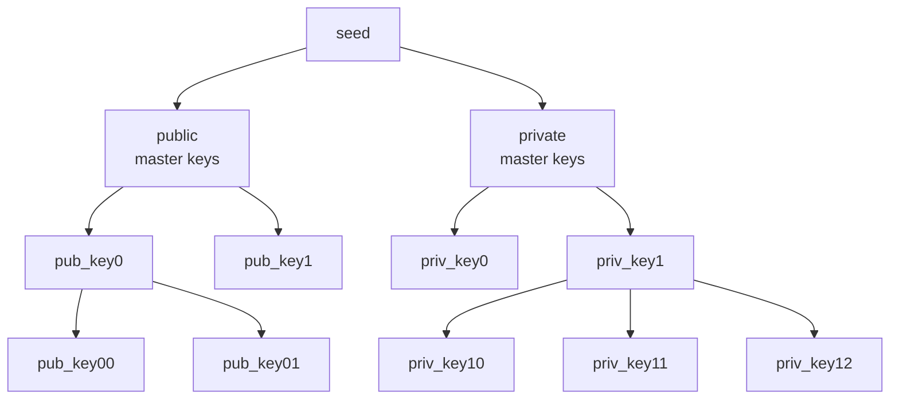

# LEE Key Protocol

## LEE Key Protocol basic types and constants

```rust
/// Public account keys
struct PrivateKey([u8; 32]);
struct PublicKey([u8; 32]);

/// Private account keys
struct SecretSpendingKey([u8; 32]);
type NullifierSecretKey = [u8; 32];
struct NullifierPublicKey([u8; 32]);
struct ViewingSecretKey { d: [u8; 32], r: [u8; 32] }
struct ViewingPublicKey(Vec<u8>); // 1184 bytes — ML-KEM 768 encapsulation key

/// Signing related keys
/// Do we need to define AccountId generation or is that handled in Sergio's?
```

## HD wallet

LEE’s HD wallet provides a streamlined mechanism for a user to generate the necessary keys. Each account requires a unique set of keys. Prior to the creation of a new account, the new set of keys can be generated based on a previously used set *owned* by the user.

The user initializes their wallet with a random mnemonic phrase ([BIP-039](https://github.com/bitcoin/bips/blob/master/bip-0039.mediawiki)). This phrase then generates *master public state keys* and *master private state keys*. Master keys are the only keys computed directly from the seed. All subsequent keys are, implicitly, computed using these master keys and some sequence of indices.

The user’s mnemonic phrase generates the wallet’s `seed`. At a high level, the seed generates a tree of keys. Specifically, the seed is used to generates two subtrees; one for public state account keys and the other for private state account keys.



The path from parent node to a child node is parametrized by an index. Each child key is computed using the parent’s *chain code* and an index. 

Each set of keys can be uniquely identified by LEE wallet with a sequence of indices from the master keys. E.g., `m_pub/0/4/12` denotes the key path:

- 0th child of public master keys
- 4th child of (0th child of public master keys)
- 12th child of [4th child of (0th child of master public keys)]

Similarly, `m_priv/0/4/12` denotes a path from the master private keys.

The index parameter is used to systematically compute and recover account keys. E.g., if no accounts can be located on-chain (public retrieval, or transactions decrypted with the corresponding `vsk` for private accounts) using for a child key of a specific index then it is reasonable to expect that subsequential indices were not used. For efficiency, Bitcoin terminates the search for a node’s children after 20 unused keys.

LEE adapts [BIP-032](https://github.com/bitcoin/bips/blob/master/bip-0032.mediawiki) for the public state keys and [ZIP-032](https://zips.z.cash/zip-0032) for the private state keys.

## Seed

The seed is the single secret from which all wallet keys are derived. It is 64 bytes, generated from a BIP-039 mnemonic phrase via PBKDF2-HMAC-SHA512:

```rust
// SeedHolder::new_mnemonic / new_os_random
let mnemonic = Mnemonic::from_entropy(&entropy_bytes); // 24-word phrase from 32 random bytes
let seed: [u8; 64] = mnemonic.to_seed(passphrase);    // PBKDF2, 2048 iterations
```

The seed is the only value derived directly from the mnemonic. Both key subtrees are rooted from it, distinguished by their HMAC key string:

```rust
// Public root
let hash_value = hmac_sha512::HMAC::mac(seed, b"LEE_master_pub");

// Private root
let hash_value = hmac_sha512::HMAC::mac(seed, b"LEE_master_priv");
```

In both cases the 64-byte HMAC output is split the same way: the first 32 bytes become the subtree's root secret key and the last 32 bytes become its root chain code.

The seed itself is never stored on-chain and should be treated with the same sensitivity as the mnemonic phrase it was derived from.

## Public account keys

Public accounts consist of three keys (secret key `sk`, Schnorr secret key `ssk` and public key `pk`). Additionally, auxillary values chain index `ci` and `chain code`

```rust
pub struct ChildKeysPublic {
    pub sk: PrivateKey,
    pub ssk: PrivateKey,
    pub pk: PublicKey,
    pub cc: [u8; 32],
    /// Can be [`None`] if root.
    pub ci: Option<u32>
}
```
TODO: `cc` likely should be `u32` rather than `u8`.


### Secret key

The secret key (`sk`) is used for managing public account ownership and authorization. Authorization for spending funds and, in some cases, modifying account data is handled by signing the transaction with the account's secret key.

```rust
let sk = nssa::PrivateKey::try_new(
    *hash_value
        .first_chunk::<32>()
        .expect("hash_value is 64 bytes, must be safe to get first 32"),
    )
```

```rust
let hash_value = self.compute_hash_value(ci);

let lhs = k256::Scalar::from_repr(
    (*hash_value
        .first_chunk::<32>()
        .expect("hash_value is 64 bytes, must be safe to get first 32"))
    .into(),
)
.expect("Expect a valid k256 scalar");

let rhs = k256::Scalar::from_repr((*self.sk.value()).into())
    .expect("Expect a valid k256 scalar");

let sk = nssa::PrivateKey::try_new(lhs.add(&rhs).to_bytes().into())
    .expect("Expect a valid private key");
```

### Schnorr secret key
A public account's Schnorr secret key (`ssk`) is used to sign transaction messages. The Schnorr secret key is computed from the account's secret key. The Schnorr secret key serves as protective layer between the account's secret key and quantum attackers.

TODO: steamline these
```rust
    pub fn tweak(value: &[u8; 32]) -> Result<Self, NssaError> {
        if !Self::is_valid_key(*value) {
            return Err(NssaError::InvalidPrivateKey);
        }
 
        let sk = k256::SecretKey::from_slice(value).map_err(|_e| NssaError::InvalidPrivateKey)?;

        let hashed: [u8; 32] = Impl::hash_bytes(sk.public_key().to_encoded_point(true).as_bytes()) 
            .as_bytes()
            .try_into()
            .expect("Sha256 outputs a 32-byte array");

        let sk = sk.to_nonzero_scalar();

        let scalar = k256::Scalar::from_repr(hashed.into())
            .into_option()
            .ok_or(NssaError::InvalidPrivateKey)?;

        Self::try_new(sk.add(&scalar).to_bytes().into())
    }
```

```rust
let ssk = nssa::PrivateKey::tweak(ssk.value()).expect("Invalid private key produced from `tweak`");
```

### Public key

A public account's public key (`pk`) is used to verify account ownership. Specifically, the public key is used to validate (Schnorr) signatures purporting to authorizing an account’s usage.


TODO: expand on

```rust
let pk = nssa::PublicKey::new_from_private_key(&sk);
```


## Private account keys

```rust
pub struct ChildKeysPrivate {
    pub value: (KeyChain, BTreeMap<PrivateAccountKind, nssa::Account>),
    pub ccc: [u8; 32],
    /// Can be [`None`] if root.
    pub cci: Option<u32>,
}
```

`KeyChain` is defined in `key_management/mod.rs`. It is the private account keychain that bundles all keys for a single private account:

```rust
pub struct KeyChain {
    pub secret_spending_key: SecretSpendingKey,
    pub private_key_holder: PrivateKeyHolder,  // holds nsk and vsk
    pub nullifier_public_key: NullifierPublicKey,
    pub viewing_public_key: ViewingPublicKey,
}

pub struct PrivateKeyHolder {
    pub nullifier_secret_key: NullifierSecretKey,
    pub viewing_secret_key: ViewingSecretKey,
}
```

### Root key generation

Master private keys are derived from the BIP-039 seed via HMAC-SHA512 keyed with `"LEE_master_priv"`. The 64-byte output is split: the first 32 bytes become the `SecretSpendingKey` (`ssk`) and the last 32 bytes become the child chain code (`ccc`).

```rust
let hash_value = hmac_sha512::HMAC::mac(seed, b"LEE_master_priv");

let ssk = SecretSpendingKey(
    *hash_value.first_chunk::<32>().expect("64-byte output"),
);
let ccc = *hash_value.last_chunk::<32>().expect("64-byte output");
```

### Child key generation

Child keys are derived from the parent's `PrivateKeyHolder` (via a SHA-256 "parent point" commitment) and the parent's `ccc`, mixed with the child index `cci`. The scheme follows ZIP-032 in spirit.

```rust
// 1. Commit to the parent's secret material
let mut parent_hash = sha2::Sha256::new();
parent_hash.update(b"LEE/keys");
parent_hash.update([0_u8; 16]);
parent_hash.update([9_u8]);
parent_hash.update(parent.private_key_holder.nullifier_secret_key);
parent_hash.update(parent.private_key_holder.viewing_secret_key.d);
parent_hash.update(parent.private_key_holder.viewing_secret_key.r);
let parent_pt = parent_hash.finalize(); // 32 bytes

// 2. Derive child ssk and ccc
let mut input = vec![];
input.extend_from_slice(b"LEE_seed_priv");
input.extend_from_slice(&parent_pt);
input.extend_from_slice(&cci.to_be_bytes()); // big-endian per BIP-032

let hash_value = hmac_sha512::HMAC::mac(input, parent.ccc);

let ssk = SecretSpendingKey(*hash_value.first_chunk::<32>().expect("64-byte output"));
let ccc = *hash_value.last_chunk::<32>().expect("64-byte output");
```

### Secret key

The `SecretSpendingKey` (`ssk`) is the root secret for a private account node. It is never transmitted or stored on-chain; all other keys are derived from it.

For both the root and each child, the `ssk` is a 32-byte value taken from the first half of an HMAC-SHA512 output (see root and child generation above).

### Nullifier keys

The nullifier secret key (`nsk`) and nullifier public key (`npk`) are derived from the `ssk` and child index. The `npk` is used to compute the `AccountId` for a private account and to generate nullifiers when an account is spent.

**`nsk` derivation** — SHA-256 keyed with domain-separation bytes and the child index:

```rust
// SecretSpendingKey::generate_nullifier_secret_key
let mut hasher = sha2::Sha256::new();
hasher.update(b"LEE/keys");  // 8 bytes
hasher.update(self.0);       // 32 bytes ssk
hasher.update([1_u8]);       // 1 byte type tag for nsk
hasher.update(index.to_be_bytes()); // 4 bytes
hasher.update([0_u8; 19]);   // 19 bytes padding

let nsk: NullifierSecretKey = hasher.finalize_fixed().into();
```

**`npk` derivation** — SHA-256 (risc0 implementation) of domain-prefixed `nsk`:

```rust
// NullifierPublicKey::from(&nsk)
let mut bytes = Vec::new();
bytes.extend_from_slice(b"LEE/keys"); // 8 bytes
bytes.extend_from_slice(&nsk);        // 32 bytes
bytes.extend_from_slice(&[7_u8]);     // 1 byte type tag for npk
bytes.extend_from_slice(&[0_u8; 23]);  // 23 bytes padding

let npk = NullifierPublicKey(risc0_sha256(&bytes));
```

**`AccountId` for a private account** — SHA-256 over a 80-byte preimage:

```rust
// AccountId::for_regular_private_account
const PRIVATE_ACCOUNT_ID_PREFIX: &[u8; 32] = b"/LEE/v0.3/AccountId/Private/\x00\x00\x00\x00";

let mut bytes = [0; 80];
bytes[0..32].copy_from_slice(PRIVATE_ACCOUNT_ID_PREFIX);
bytes[32..64].copy_from_slice(&npk.0);
bytes[64..80].copy_from_slice(&identifier.to_le_bytes()); // u128, little-endian

let account_id = SHA-256(bytes);
```

**Nullifier computation:**

```rust
// For account update
let nullifier = SHA-256(b"/LEE/v0.3/Nullifier/Update/\x00\x00\x00\x00\x00" || commitment || nsk);

// For account initialization
let nullifier = SHA-256(b"/LEE/v0.3/Nullifier/Initialize/\x00" || account_id);
```

### Viewing keys

The viewing secret key (`vsk`) is a 64-byte ML-KEM 768 seed split into two 32-byte halves `d` and `r`. The viewing public key (`vpk`) is the corresponding ML-KEM 768 encapsulation key (1184 bytes). The `vsk` allows the holder to decrypt ciphertexts sent to the account; the `vpk` is the address component senders use to encrypt.

**`vsk` derivation** — HMAC-SHA512 over a 64-byte domain-tagged input:

```rust
// SecretSpendingKey::generate_viewing_secret_seed_key
let mut bytes: [u8; 64] = [0; 64];
// b"LEE/keys" (8) || ssk (32) || [2] (1) || index.to_be_bytes() (4) || [0; 19] (19) = 64
bytes[0..8].copy_from_slice(b"LEE/keys");
bytes[8..40].copy_from_slice(&self.0);
bytes[40] = 2; // type tag for vsk
bytes[41..45].copy_from_slice(&index.to_be_bytes());
// bytes[45..64] remain 0

let full_seed = hmac_sha512::HMAC::mac(bytes, b"LEE_viewing_seed");

let vsk = ViewingSecretKey {
    d: *full_seed.first_chunk::<32>().expect("64-byte output"),
    r: *full_seed.last_chunk::<32>().expect("64-byte output"),
};
```

**`vpk` derivation** — ML-KEM 768 encapsulation key from seed:

```rust
// ViewingPublicKey::from(&vsk)
let mut seed_bytes = [0_u8; 64];
seed_bytes[..32].copy_from_slice(&vsk.d);
seed_bytes[32..].copy_from_slice(&vsk.r);

let dk = MlKem768::DecapsulationKey::from_seed(seed_bytes);
let vpk = ViewingPublicKey(dk.encapsulation_key().to_bytes().to_vec()); // 1184 bytes
```

**Shared secret (receiver side)** — ML-KEM 768 decapsulation using `vsk.d` and `vsk.r`:

```rust
// KeyChain::calculate_shared_secret_receiver
let shared_secret = SharedSecretKey::decapsulate(&ephemeral_public_key, &vsk.d, &vsk.r);
```
