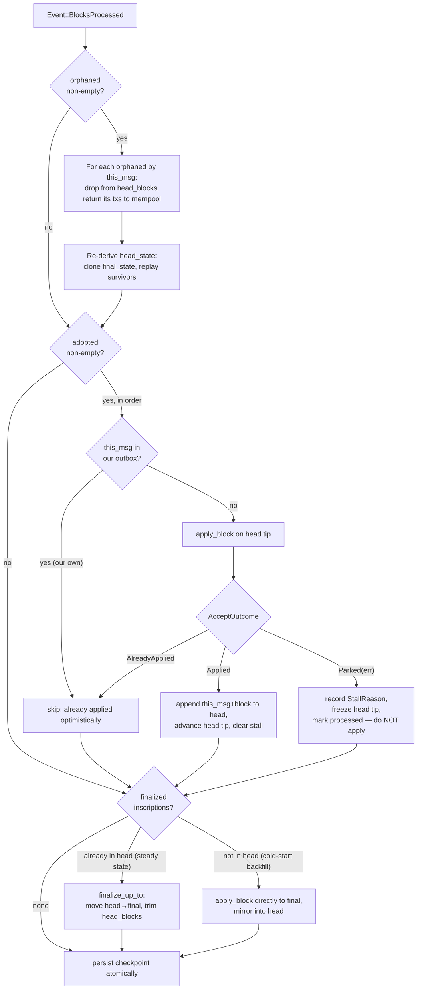
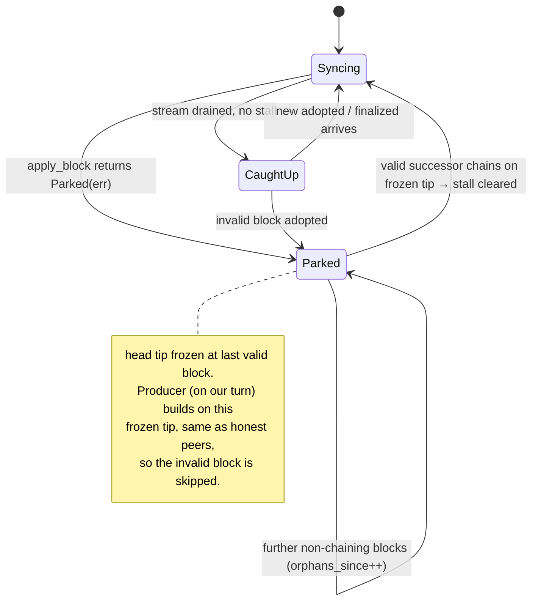

# `lez/chain_state` — Two-Tier Chain State

Design doc for the shared block-apply engine and two-tier chain state that
backs decentralized sequencing. Status: **interface freeze** — the
`apply_block` signature and the `ChainState` tip/state shape below are the
contract the produce-on-turn and follow-blocks tracks build against. Changing
them after the tracks split forces rework in both.

Branch: `erhant/lez-two-tip-chain-state` (off `erhant/indexer-recoverable-invalid-blocks`).

---

## 1. Motivation

Decentralized sequencing requires every honest node — sequencer or indexer — to
converge on the same chain and the same state by running one deterministic
_validate-then-apply_ path over blocks pulled from the channel. That path today
lives only inside the indexer (`lez/indexer/core/src/block_store.rs`), where the
recoverability work built a park-and-skip ingest: `accept_block` validates a
block against the current tip, applies it to a scratch clone of state atomically,
and on any failure records a `StallReason`, freezes the tip, and marks the bad
block _processed_ without applying it. The sequencer has no equivalent — it only
produces blocks and reads peer inscriptions for finalization; it never executes
peer blocks into its own state.

This crate lifts that logic into a shared home and generalizes it into a
**two-tier** state machine so the sequencer can produce on the head while both
sequencer and indexer expose their exact current state.

## 2. Crate placement & layering

```
lee_core  ←  lee (owns V03State)  ←  common (owns Block, BedrockStatus, clock_invocation, recompute_hash)  ←  lez/chain_state  ←  { indexer/core, sequencer/core }
```

- **Not** `lee_core`: that is the RISC0 guest crate; a stateful host machine has
  no place in the zkVM circuit and does not know what a `Block` is.
- **Not** `lee`: the apply logic needs `Block`/`BedrockStatus`/`clock_invocation`
  from `common`, and `common` depends on `lee` — putting it in `lee` inverts the
  layer.
- `lez/chain_state` sits above `common`, depends on `common` + `lee`, and is
  consumed by both `indexer/core` and `sequencer/core`.

**Persistence boundary (decision: A).** `chain_state` holds the in-memory state
machine and the pure logic; it performs **no I/O**. Each consumer keeps its own
`RocksDBIO` and drives the `scratch → put_block → commit` ordering, exactly as
`accept_block` does today. This keeps the crate fully unit-testable without a DB.
A storage-trait abstraction (option B) is a possible later follow-up, not part of
this task.

## 3. The `apply_block` entry point

A single pure function, called identically whether the block was produced by us,
adopted from a peer, or read finalized from the channel:

```rust
/// Validate `block` against `tip`, then apply it to `state`. Pure: no I/O.
/// Mutates `state` only on success; on failure `state` is untouched and the
/// caller parks.
fn apply_block(
    tip: Option<&Tip>,
    block: &Block,
    state: &mut V03State,
) -> Result<(), BlockIngestError>;
```

Validation order (unchanged from the indexer): hash integrity
(`recompute_hash`) → block-id continuity → `prev_block_hash` linkage, with a
`None` tip expecting the genesis block. Application splits off the mandatory
trailing clock tx, executes user txs (genesis = public-only), applies the clock
last.

Shared types moved into the crate: `AcceptOutcome`, `BlockIngestError`,
`StallReason`, and `Tip`.

```rust
struct Tip { block_id: u64, hash: HashType, l1_slot: Slot }

enum AcceptOutcome { Applied, AlreadyApplied, Parked(BlockIngestError) }
```

`Tip` carries `l1_slot` (recorded atomically with the tip) because the anchor /
chain-consistency logic keys on the inscription slot, not just `(id, hash)`.

## 4. The two-tier `ChainState`

```rust
struct ChainState {
    final_state:  V03State,        // driven by finalized channel ops
    final_tip:    Option<Tip>,
    head_state:   V03State,        // final_state + applied head blocks
    head_blocks:  Vec<HeadEntry>,  // ordered, above final_tip
    stall:        Option<StallReason>,
}

struct HeadEntry { this_msg: MsgId, block: Block }
```

The **head** tier is a MsgId-keyed chain (adopted/orphaned reference
`this_msg`/`parent_msg`); the **final** tier is block-id-keyed. `apply_block`
validation stays LEZ-level (`block_id` + `prev_block_hash`) — the two chains run
in parallel and must agree, so we validate via `apply_block` _and_ track `MsgId`
for revert correlation.

Operations:

- `apply_adopted(inscription) -> AcceptOutcome` — dedup by `this_msg` against our
  outbox, else `apply_block` on the head tip; on success push `HeadEntry`; on
  failure record stall + park (head tip frozen).
- `apply_channel_update(orphaned, adopted)` — revert every `orphaned` by
  `this_msg`, re-derive `head_state` (clone `final_state`, replay survivors),
  then apply every `adopted` in order. Atomic per event.
- `finalize_up_to(block_id)` — move `head_blocks` up to `block_id` into
  `final_state` (already validated; a move, not a re-apply).
- `apply_finalized(inscription)` — steady state: if present in head by
  `this_msg`, `finalize_up_to`; cold-start backfill (not in head):
  `apply_block` directly to `final_state`, mirror into head.
- `rollback_orphan(this_msg)` — drop from that entry forward, re-derive head.
- `status() -> { final_height, head_height, stall }` — for RPC/UI.

For the **indexer** (finalized-only `next_messages` stream), `head_blocks` stays
empty and `head == final`; it exercises only `apply_finalized`. The **sequencer**
uses both tiers from day one.

## 5. Event → tier mapping

`Event::BlocksProcessed { checkpoint, channel_update: { orphaned, adopted }, finalized }`:

| Input                 | Source                                         | Effect                                              |
| --------------------- | ---------------------------------------------- | --------------------------------------------------- |
| adopted inscription   | `channel_update.adopted`                       | validate + apply to **head**                        |
| orphaned inscription  | `channel_update.orphaned`                      | revert from **head**, return txs to mempool         |
| finalized inscription | `finalized[].ops` (`FinalizedOp::Inscription`) | move head→**final**, or apply directly on backfill  |
| own publish           | publish-return                                 | optimistically apply to **head**, record `this_msg` |

**Golden rules:** (1) validation is deterministic, so every honest node makes the
same accept/park decision. (2) An invalid block is _processed but discarded_ —
never applied, never halts the node. (3) Finalized is never reverted. (4) We
rebuild orphaned blocks ourselves; we do not trust the SDK's republish (it keeps
stale LEZ contents — prev-hash, tx selection, and resulting state were all
computed against the old parent).

---

## 6. Scenarios

### Processing one `BlocksProcessed` event



### Park / recovery status



### Scenario table

**Normal flow**

| #   | Scenario                                 | Handling                                                      | Expected                            |
| --- | ---------------------------------------- | ------------------------------------------------------------- | ----------------------------------- |
| 1   | Adopted block chains cleanly on head tip | `apply_block` → `Applied`; append `{this_msg, block}` to head | head advances; converges with peers |
| 2   | Our own block comes back in `adopted`    | dedup by `this_msg` against outbox → skip                     | no double-apply                     |
| 3   | Adopted block later finalizes            | `finalize_up_to` moves head→final, trims `head_blocks`        | final advances; no re-apply         |
| 4   | Re-delivery of an already-applied block  | id ≤ tip & stored hash matches → `AlreadyApplied`             | idempotent, no state change         |

**Reorg / orphan**

| #   | Scenario                                                   | Handling                                                                                     | Expected                                        |
| --- | ---------------------------------------------------------- | -------------------------------------------------------------------------------------------- | ----------------------------------------------- |
| 5   | Our block orphaned at turn handoff (stale-parent race)     | revert by `this_msg`, return txs to mempool, **rebuild** on new head tip (not SDK republish) | our txs re-queued; next block on correct parent |
| 6   | Batch reorg: some `orphaned` + some `adopted` in one event | revert all orphaned, re-derive head, then apply all adopted in order                         | deterministic convergence                       |
| 7   | Orphan chain (parent transitively off canonical)           | SDK surfaces all affected as `orphaned`; revert each, replay survivors                       | head_state matches new canonical branch         |

**Invalid / bad block**

| #   | Scenario                                                            | Handling                                                                                 | Expected                                        |
| --- | ------------------------------------------------------------------- | ---------------------------------------------------------------------------------------- | ----------------------------------------------- |
| 8   | Authorized sequencer posts a block with an invalid state transition | `apply_block` → `Parked(StateTransition)`; freeze head tip, record stall, mark processed | park-and-skip; no apply, no halt                |
| 9   | Broken chain link / hash mismatch / unexpected id in adopted        | `Parked(BrokenChainLink / HashMismatch / UnexpectedBlockId)`; same park                  | frozen tip; peers park identically              |
| 10  | Undeserializable inscription payload                                | park with `Deserialize` (no header); processing advances                                 | recover when a valid block chains on frozen tip |
| 11  | Valid successor after a park (recovery)                             | block chaining on frozen tip → `Applied` → clear stall                                   | head resumes automatically; no divergence       |
| 12  | Further non-chaining blocks while parked                            | keep first `StallReason`, bump `orphans_since`                                           | original cause preserved; still parked          |

**Producing while parked**

| #   | Scenario                                        | Handling                                                                                        | Expected                                                                                   |
| --- | ----------------------------------------------- | ----------------------------------------------------------------------------------------------- | ------------------------------------------------------------------------------------------ |
| 13  | It's our turn but head is parked on a bad block | producer builds on the **frozen valid tip** (head tip = last valid), skipping the invalid block | we emit the next valid block on the same parent honest peers use — chain moves on our turn |

**Startup / backfill**

| #   | Scenario                                            | Handling                                                                                           | Expected                              |
| --- | --------------------------------------------------- | -------------------------------------------------------------------------------------------------- | ------------------------------------- |
| 14  | Cold start / reconnect backfill                     | history via `finalized`, empty `channel_update`; apply directly to final + mirror head             | head == final until live deltas start |
| 15  | Local store belongs to a different chain (L1 reset) | anchor-based `chain_consistency` check at startup: wipe+reindex if `allow_chain_reset`, else error | no silent divergence                  |

## 7. Invariants

Should-never-happen conditions — assert/log, don't silently absorb:

- An `orphaned` entry never references a block at or below the **final** tip —
  finalized is irreversible. If seen, it is a bug.
- `head` tip ≥ `final` tip at all times; `head_blocks` holds exactly the blocks
  between them.
- After processing any event, `head_state == final_state` replayed through
  `head_blocks` (the re-derivation is the source of truth).
- A parked node's frozen tip is identical across all honest nodes for the same
  invalid block (deterministic validation).
